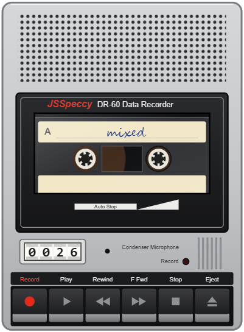
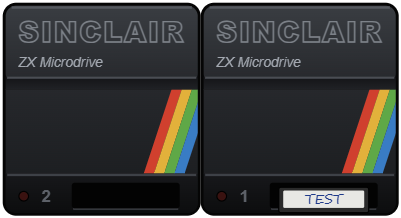
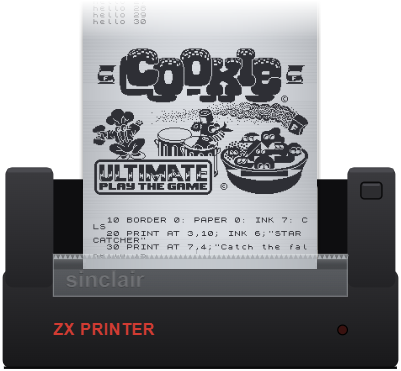
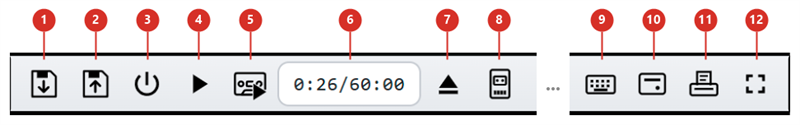

# JSSpeccy3 / dev

**▶ [Live demo](https://baltazarstudios.com/files/jsspeccy/)** &nbsp;·&nbsp; **[Source on GitHub](https://github.com/gdevic/jsspeccy3)**

A ZX Spectrum emulator for the browser

> **Note:** the code in the `dev` branch has been heavily modified from the original version in the `main` branch. It adds many features that `main` does not have (listed below), and its behaviour, UI and internals differ substantially. Use `main` for the original JSSpeccy 3.

## Why JSSpeccy3 / dev

Most Spectrum emulators treat peripherals as menu items and forget your work when the window closes. JSSpeccy3 / dev puts the hardware on your desk: a cassette recorder, two Microdrives and a ZX Printer that you can drag around, and that work and sound like the originals. The recorder's keys clunk, its motor hums and the tape whines as it winds, the Microdrives whirr, and the printer buzzes as its paper rises. Your cassettes, cartridges and printouts are still there on your next visit.

It runs in any browser and loads thousands of games in one click, with cheats you can switch on and off. Plug in a joystick or gamepad and play as on the real machine, or click any keyword on the on-screen keyboard and it is typed for you. On a first visit the cassette and cartridge boxes already hold starter programs, from Tetris and Invaders to a Mandelbrot set you can zoom into and a guessing game that learns, so there is something to play straight away.

* **A tape recorder you can use:** `SAVE` onto your own cassettes, wind anywhere and `LOAD` from there, record the beeper.
* **Devices, not menu items:** Microdrives and a ZX Printer stand beside the Spectrum on their leads, and you drag them wherever you like.
* **A keyboard that knows the ROM:** click any legend and the right shifts and modes are pressed for you.
* **Games, cheats and sessions built in:** PlayZX, the Internet Archive, Tipshop pokes, a whole session in one file, F2 / F3 to save and recall a good position instantly, and F8 held down to warp through the boring parts.
* **Something to play with at once:** cassettes and Microdrive cartridges of original BASIC programs are in the boxes on a first visit.
* **Embed it, script it:** one line of JavaScript on your page, and an API to drive it.

---

## Features

* Emulates the Spectrum 48K (original ROM and gw03 ROM), Spectrum 128K and Pentagon machines
* Passes the FUSE Z80 test suite; contended memory, floating bus, AY stereo and the beeper are emulated
* Play using a joystick / gamepad connected to your PC (mapped as Kempston, Cursor or Sinclair)
* Peripherals operate like in real-life (tape can play, rewind, write over existing recording,...)
* Loads SZX, Z80 and SNA snapshots
* Loads TZX and TAP tape images, instantly through the ROM loader or in real time; a TZX plays its turbo, pure tone, pulse, direct recording, CSW and generalized data blocks, follows its jumps, loops and calls.
* Detects custom tape loaders (Speedlock and other turbo loaders) and plays the tape for them automatically, fast-forwarded when instant loading is on
* Drop any of the above files, or a ZIP holding them, onto the screen and it opens; an opened tape loads itself (Options → Auto-load tapes)
* Saves and restores the whole session as one file: the running machine, tape, tape recorder cassettes, Microdrive cartridges, printout and settings
* Instant save and recall (**F2** and **F3**): keep a good position while playing and return to it at once; see [Instant save and recall](#instant-save-and-recall)
* Warp (**F8** held down): the whole machine, tape, Microdrives and printer included, runs as fast as the computer can for as long as the key is held; see [Warp](#warp)
* A portable cassette recorder: SAVE records onto 60-minute cassettes kept in the browser between visits, and LOAD reads them back, with working keys, turning reels and a tape counter in seconds; holding Record yourself records the machine's beeper sound too
* ZX Interface 1 with two ZX Microdrives: format, save and load cartridges, and keep them in the browser between visits
* ZX Printer: LPRINT, LLIST and COPY print onto a scrolling roll of silver paper, which can be torn off or saved as a PNG
* Starter programs (**File → Starter programs…**): a first visit finds cassettes of games, demos and printer programs in the cassette box, and a guessing game that learns on two Microdrive cartridges
* Opens games straight from the PlayZX online catalog (~10,800 titles), or from a search of the Internet Archive
* Game cheats: ~23,000 cheats for ~3,700 games from the Tipshop database, found for the loaded game, tick to apply and untick to undo
* Character picker (**Options → Character picker**): click a character on the screen to see which ROM character it is and the keys that type it, and double-click it to type it, use it for a game option selection
* An on-screen keyboard where every command can be clicked
* Support for touch screens, multi-touch
* Drag and reposition peripherals as you wish
* Embeds in your own page with one line of JavaScript, and is scriptable: power it on, type BASIC into it on any of its ROMs, work the tape recorder and wait for the result

## Find games

The **File → Find games…** menu item searches the Internet Archive's ZX Spectrum software library. Type part of a title and press Enter, then double-click a result, or click its **Open** button, to load and start it. The first 50 matches are listed, and it needs an internet connection.

## PlayZX game catalog

The **File → PlayZX open…** menu item browses the PlayZX catalog of ZX Spectrum tape images and loads one straight into the emulator. The **Browse A-Z** tab walks the catalog by initial letter, then by title, then lists the individual releases under that title. The **Search** tab is a live query box: plain text matches a title prefix, a leading space matches a publisher prefix, a leading `=` is spliced in as a raw SQL condition over the `Name, Pub, Year, Duration, Variation, Rating` columns, and a trailing `?` picks one match at random. The menu item only appears when the page is served from a host the PlayZX server allows downloads for. The same catalog is also available as an [Android app](https://play.google.com/store/apps/details?id=com.baltazarstudios.playzxtapes).

## Pokes (game cheats)

The **File → Pokes…** menu item opens a cheat browser over a committed catalog of the complete Tipshop poke database (~3,700 games, ~23,000 cheats, ~72,000 pokes, sourced from [The Tipshop](https://www.the-tipshop.co.uk/) via the [all-tipshop-pokes](https://github.com/ladyeklipse/all-tipshop-pokes) collection). The search box is pre-filled with the name of the loaded game (from an opened file or a URL). Ticking a cheat pokes it into emulated memory, as a Multiface does; unticking restores the bytes that were overwritten. 

Use cheats after you have loaded a game, to patch it. Then, enjoy the game!

## Devices that behave like hardware

The tape recorder, the Interface 1 with its Microdrives and the ZX Printer are devices, not menu items, and they act like the real thing.

* **Connect them** with a toolbar button, without resetting the machine. They start connected on a first visit and stay as you left them.
* **Drag them anywhere:** an open hand means drag, a pointing finger means click. The lead stretches to follow, devices slide along each other and never overlap, and a click on a lead puts one back. Where they stand is remembered in this browser.
* **They run on their own:** the recorder winds, plays and records with the Spectrum off or paused, and it sounds like it: motor, winding, key clunks. The drives whirr, the printer buzzes, and its paper rises out of it and scrolls back with the mouse wheel.
* **They keep what you did:** cassettes, cartridges and the printer's roll stay in the browser between visits, and go into a saved session.
* **Emulated the way the hardware works:** the printer through its styli and paper feed, so a program's own printer routine works, and the Interface 1 through its own shadow ROM.

## Tape recorder

A portable cassette recorder that plays the Spectrum's tape deck. Connect it with button 8.

* **Games:** every tape you open goes into it as a write-protected cassette, and the toolbar's tape buttons work its keys.
* **Your own tapes:** `SAVE` records onto a blank 60-minute cassette and `LOAD` reads it back, as an alternative to the Microdrives. `SAVE` is instant; turn Options → Instant tape loading off to save in real time, border stripes and all.
* **Real keys, real tape:** Play, Record, Rewind, F Fwd, Stop, Eject. Recording erases what it goes over, and offers to undo it.
* **Wind to a time:** click the counter and type seconds or `m:ss`.
* **`LOAD` reads from wherever the tape is** and never winds by itself, so wind to the part first. Land in the middle of a block and you only hear noise; `LOAD` takes the next one.
* **Record sound too:** hold Record yourself and the beeper goes onto the tape: music, `BEEP`, even a turbo saver, which loads back in real time.
* **Click the recorder** for its panel: a map of the tape, each part with its `LOAD` command (click one to wind there; Type in types the command into the Spectrum for you to press Enter, and clicking it copies it), and the cassette's name, colour and write-protect tab.
* **File → Tape cassettes…** is the cassette box. It keeps cassettes in the browser and imports and saves them as `.tap` or `.tzx`, or the whole box as a ZIP.
* It has its own power: wind, play or record while the Spectrum is off or paused.

 

## ZX Interface 1 and Microdrives

Two Microdrives behind a ZX Interface 1 (edition 2 ROM). Connect them with button 10, and use a 48K machine or 48 BASIC.

* **BASIC works as documented:** `FORMAT "m";1;"name"`, `SAVE *"m";1;"name"`, `LOAD *"m";1;"name"`, `VERIFY *`, `CAT 1`, `ERASE` and `OPEN #` streams. RS232 and ZX Net are not emulated.
* **Click a drive** to insert a cartridge, or, with one in, for its panel: the tape loop, its files (click one for its `LOAD *` command, which Type in types into the Spectrum for you to press Enter), write-protect, Format, save to PC and Eject. Dropping an `.mdr` file onto a drive inserts it.
* **File → Microdrive cartridges…** is the cartridge box, kept in the browser: create, import (`.mdr` or a ZIP), rename, recolour, duplicate, save.

 

## ZX Printer

Connect it with button 11. `LPRINT`, `LLIST` and `COPY` print onto a roll of silver paper that rises out of the printer, and a full-screen `COPY` takes about 8½ seconds, as on the real one.

* **Click the printer** to load a new roll, tear the printout off, or save it as a PNG (a ZIP of PNGs when it is very long).
* **FEED** on the printer's right tower feeds blank paper while held.
* The roll and its printout stay between visits. When the roll runs out, printing waits for paper: load a new roll, or press BREAK.

 

## Starter programs

A first visit finds the cassette box and the cartridge box filled with original BASIC programs written for this emulator, so there is something to play with straight away, and something to show off every device with. **File → Starter programs…** lists them, and puts back any that were taken out of the boxes.

| Cassette | Programs |
| --- | --- |
| Home games | **BIORHYTHM** charts your body, feelings and mind for a month from your birthday. **INVADERS**: O and P move, SPACE fires. **TETRIS**: O and P move, Q turns, A drops faster, SPACE drops at once. |
| Printer fun | **BANNER** prints your words down the roll in letters as tall as the paper is wide. **CALENDAR** shows any month, and prints it or a whole year. **MAZE** carves a new maze to solve on the screen or on paper. |
| Demos | **MANDEL** draws the Mandelbrot set in BASIC, taking its time. **ZOOM** draws it again in machine code, fast enough to zoom into: the arrow keys move a flashing square, Z zooms in on it, X zooms out. **PATTERNS** draws times tables round a circle, roses, spirographs and Lissajous figures. **TUNE** plays tunes on a keyboard that lights up, or lets you play it. |
| Projects | **HANGMAN**, **SIMON** and **OXO** (noughts and crosses against the Spectrum). |
| Blank C60 | Nothing yet: it is for your own `SAVE`. |

* **Load one from a cassette:** Home games starts in the recorder. Click the recorder for the list of its parts, click one to wind there, then Type in puts `LOAD ""` into the Spectrum for you to press Enter. Every program starts by itself.
* **The guessing game:** with the HOME cartridge in Microdrive 1 and DATA in Microdrive 2, as a first visit finds them, type `RUN` in 48 BASIC with no program in the Spectrum, and the Interface 1 loads the HOME cartridge's menu. Think of a thing in your home, or an animal, and the game finds out which by asking yes or no questions. When it guesses wrong, it asks what it was and for a question that tells the two apart, and keeps what it learned on the DATA cartridge.
* **The printer programs** want the ZX Printer connected. BIORHYTHM, MAZE and PATTERNS also copy their screen to it.
* The cassettes are write-protected, so they stay as they came. The programs' listings are in `starter/`, ZOOM's machine code with them as assembly, and how they become cassettes and cartridges is in [docs/tech_notes.md](docs/tech_notes.md).

## Toolbar

The toolbar under the display has a button for each thing you do most, and a tooltip on each. Hover a button to see its name.

1. **Save session**: saves the whole session (machine, tape, cassettes, cartridges, printout and settings) to the PC as one file. See [Saving and restoring a session](#saving-and-restoring-a-session).
2. **Restore session**: restores a saved session, after showing what it holds and asking first. Dropping the file onto the Spectrum does the same.
3. **Reset**: resets the Spectrum.
4. **Pause and resume**: pauses the running machine, and runs a paused one again.
5. **Play or stop the tape**: starts the tape in the tape slot, or stops it.
6. **Tape counter**: the tape's position and its length. With a tape opened, click it to jump to any part of the tape.
7. **Eject tape**: takes the tape out.
8. **Tape recorder**: connects the portable cassette recorder, or disconnects it. See [Tape recorder](#tape-recorder).
9. **On-screen keyboard**: shows or hides the keyboard under the display. See [On-screen keyboard](#on-screen-keyboard).
10. **Interface 1 and Microdrives**: connects the ZX Interface 1 with its two Microdrives, or disconnects them. See [ZX Interface 1 and Microdrives](#zx-interface-1-and-microdrives).
11. **ZX Printer**: connects the printer, or disconnects it. See [ZX Printer](#zx-printer).
12. **Fullscreen**: enters or leaves full-screen mode.

Buttons 1, 2, 8, 10 and 11 are not offered on a page embedded with the `sandbox` option, and none of the toolbar is shown with `uiEnabled` off.

## Saving and restoring a session

Button 1 saves everything to one file, and button 2 brings it back: the running machine, tape, cassettes, cartridges, printout and settings.

* **Restore** from button 2, from File → Open, or by dropping the file onto the Spectrum. It shows what the session holds and asks first, and adds its cassettes and cartridges to your boxes without overwriting or deleting anything.
* **It resumes where it was saved**, running, paused or switched off, except in the middle of a tape playing or recording in real time.
* **It is a plain ZIP** of standard files (`.szx` snapshot, `.tzx` cassettes, `.mdr` cartridges, `printout.png`), so any part opens on its own.
* Needs the toolbar, so it is not offered on a page with `sandbox` or `uiEnabled` off.

## Instant save and recall

**F2** saves the Spectrum as it is and **F3** puts it back, to return to a good position while playing.

* **Only the Spectrum:** processor, memory, border, memory paging and sound chip. The keys held, the joystick, the tape and the connected devices are left as they are, so recalling does not release a key you are holding.

## Warp

Hold **F8** and the Spectrum runs as fast as the computer can, often a hundred times real time or more, until the key is let go. Use it to get through a tape loading in real time, a long BASIC program, a printout or a game's slow parts.

## On-screen keyboard

Button 9. Everything printed on the keys can be clicked, not only the keys.

* **Click any legend:** keyword, symbol, colour, block graphic. The emulator presses the shifts and modes that enter it, in 48 BASIC, 128 BASIC and TR-DOS alike. The line under the keyboard names what a click enters and the keys it presses.
* **Shifts are sticky:** tap CAPS SHIFT or SYMBOL SHIFT to latch it for the next key, or tap twice to lock it. Hold it while pressing another key for an ordinary shift, as a game's fire button needs. Tap one shift while the other is latched for extended mode.
* **Hold to repeat:** keep the mouse down on DELETE or an arrow and the ROM repeats it.
* **Touchscreens:** each finger presses a whole key, so several go down together as on the real keyboard.

The menu option **Options → Simple keyboard** makes the mouse press whole keys, as a finger does, instead of the legend under the pointer. It is off at first, and remembered in this browser.

## Recognising characters on the screen

Click a character on the Spectrum's screen and a bubble names the ROM character, its code and the keys that type it. **Double-click** it to type it, which is handy for picking a game's menu option. Characters that need extended mode are shown but not typed. The picker works only while **Options → Character picker** is ticked; it is off at first, and remembered in this browser.

## Deployment

Building from source, embedding the emulator in your own page, scripting it and troubleshooting are in [docs/deployment.md](docs/deployment.md).

## Implementation notes

JSSpeccy 3 is a complete rewrite of JSSpeccy for high-performance web apps: the emulation runs in a Web Worker and the Z80 core is WebAssembly, compiled from AssemblyScript. How it is built, and the rules for working on it, are in [docs/tech_notes.md](docs/tech_notes.md).

## Licence

JSSpeccy 3 is licensed under the GPL version 3 - see COPYING.
