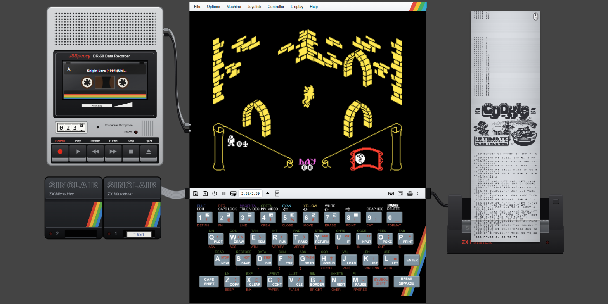

# JSSpeccy 3

**▶ [Live demo](https://baltazarstudios.com/files/jsspeccy/)** &nbsp;·&nbsp; **[Source on GitHub](https://github.com/gdevic/jsspeccy3)**

A ZX Spectrum emulator for the browser

> **Note:** the code in the `dev` branch has been heavily modified from the original version in the `main` branch. It adds many features that `main` does not have (listed below), and its behaviour, UI and internals differ substantially. Use `main` for the original JSSpeccy 3.



---

## Features

* Emulates the Spectrum 48K, Spectrum 128K and Pentagon machines
* Handles all Z80 instructions, documented and undocumented
* Cycle-accurate emulation of scanline / multicolour effects
* AY and beeper audio
* Play using a joystick / gamepad connected to your PC (Kempston, Cursor and Sinclair)
* Loads SZX, Z80 and SNA snapshots
* Loads TZX and TAP tape images, instantly through the ROM loader or in real time
* Detects custom tape loaders (Speedlock and other turbo loaders) and plays the tape for them automatically, fast-forwarded when instant loading is on
* Loads any of the above files from inside a ZIP file
* Saves and restores the whole session as one file: the running machine, tape, tape recorder cassettes, Microdrive cartridges, printout and settings
* A portable cassette recorder: SAVE records onto 60-minute cassettes kept in the browser between visits, and LOAD reads them back, with working keys, turning reels and a tape counter in seconds; holding Record yourself records the machine's beeper sound too
* ZX Interface 1 with two ZX Microdrives: format, save and load cartridges, and keep them in the browser between visits
* ZX Printer: LPRINT, LLIST and COPY print onto a scrolling roll of silver paper, which can be torn off or saved as a PNG
* Opens games straight from the PlayZX online catalog (~10,800 titles)
* Any display size from 100% to 400%, set with a slider that catches on the whole and half sizes, and fullscreen; the menu bar and toolbar are compact below 200%, and the chosen size is remembered for the next visit
* A switched-off TV screen until the machine is started, which then powers on like a picture tube

## Implementation notes

JSSpeccy 3 is a complete rewrite of JSSpeccy to make full use of the web technologies and APIs available as of 2021 for high-performance web apps. The emulation runs in a Web Worker, freeing up the UI thread to handle screen updates, and sound plays from an AudioWorklet on the browser's audio thread, so a busy page can't starve it. The emulator core (consisting of the Z80 processor emulation and any auxiliary processes that are likely to interrupt its execution multiple times per frame, such as constructing the video output, reading the keyboard and generating audio) runs in WebAssembly, compiled from AssemblyScript (with a custom preprocessor).

## Pokes (game cheats)

The **File → Pokes…** menu item opens a cheat browser over a committed catalog of the complete Tipshop poke database (`static/pokes/pokes.json`: ~3,700 games, ~23,000 cheats, ~72,000 pokes, sourced from [The Tipshop](https://www.the-tipshop.co.uk/) via the [all-tipshop-pokes](https://github.com/ladyeklipse/all-tipshop-pokes) collection). The search box is pre-filled with the name of the loaded game (from an opened file or a URL) and matches titles fuzzily, so "007 - The Spy Who Loved Me" finds "Spy Who Loved Me, The". Ticking a cheat pokes it into emulated memory Multiface-style (honouring the `.POK` format's 128K bank field); unticking restores the bytes that were overwritten. Cheats whose value is user-selectable (e.g. "number of lives") get a small input field. The catalog is lazy-loaded on first use and can be regenerated with `node tools/gen-pokes-catalog.js <all-tipshop-pokes checkout>`.

## PlayZX game catalog

The **File → PlayZX open…** menu item browses the PlayZX catalog of ZX Spectrum tape images and loads one straight into the emulator. The **All** tab walks the catalog by initial letter, then by title, then lists the individual releases under that title (publisher, year, playing time, and any variation note). The **Search** tab is a live query box: plain text matches a title prefix, a leading space matches a publisher prefix, a leading `=` is spliced in as a raw SQL condition over the `Name, Pub, Year, Duration, Variation, Rating` columns, and a trailing `?` picks one match at random (two characters minimum, 100 results maximum). The menu item only appears when the page is served from a host the PlayZX server will mint a download session for, since everywhere else the browsing would work and every download would be refused; see `PLAYZX_HOSTS` in `runtime/playzx-session.js`.

## Tape recorder

The toolbar button beside the tape eject button connects a portable cassette recorder, or disconnects it, without resetting the machine. It stands to the left of the Spectrum above the Microdrives, joined to it by its EAR and MIC leads, and plays the part of the Spectrum's tape deck: while it is connected, every tape goes into it (File → Open, a dropped file, Find games, PlayZX or the `openUrl` option) as a pre-recorded, write-protected cassette, and loads as it always has. The toolbar's tape buttons work its keys, and the toolbar's counter follows it. Its own cassettes, blank 60-minute tapes from the cassette box, are for your own work: `SAVE` records onto them and `LOAD` reads them back, as an alternative to the Microdrives. Disconnecting it leaves your cassette in it, out of reach of SAVE and LOAD until it is connected again, and an opened tape plays on from the toolbar as before.

The keys work as a real recorder's do: Play; Record, which takes Play down with it and springs back on a write-protected tape; Rewind and F Fwd, which build up speed and stop by themselves at either end of the tape; Stop; and Eject, which opens the door and puts your cassette back in the box, keeping its place on the tape. The reels turn as fast as the tape would drive them, the take-up reel slowing as it fills, the counter counts the seconds along the tape from 0000 to 3600, and the red light shows while recording. The motor hums, winding whines as it speeds up, and the keys clunk. The Spectrum's MIC output also reaches its speaker faintly, as on a real 48K, so a SAVE is heard whether the recorder is connected or not.

`SAVE` presses Record and Play by itself, and lets them go again once it is done, recording wherever the tape is. With File → Instant tape loading on, each block goes onto the tape at once and the counter jumps past it; with it off, the ROM saves in real time, border stripes and all, while the tape runs. Recording erases what it goes over, as on a real tape; when it erases an earlier recording, the recorder says what it recorded over and offers to undo it. `LOAD` reads onwards from wherever the tape is, as a real tape is read, and never winds it by itself: wind to the part you want first, with Rewind and F Fwd or by picking the part in the recorder's panel. With nothing on the tape ahead, LOAD waits, and the recorder says so. The ROM's own saving routine is what is caught, so `SAVE "name"`, `SAVE "name" CODE`, `SAVE "name" SCREEN$` and `SAVE "name" DATA`, from 48 BASIC or 128 BASIC or a program calling that routine, are all recorded; a program's own turbo saver is recorded only while you hold Record yourself, as sound (see below). A SAVE cut short by BREAK, Stop or the end of the tape leaves a damaged recording, which fails to load with "R Tape loading error".

Pressing Record yourself also records the machine's sound, as a real recorder does: the Spectrum's MIC socket carries the speaker's signal as well as SAVE's, so game music, `BEEP` and anything else played on the beeper goes onto the tape while Record is held, and Play plays it back through the speaker. The speaker and MIC bits of port 0xFE are recorded alike, as one level that rises and falls with the socket's voltage, and a recording plays back as loud as anything else on tape. Each stretch of sound becomes a part of its own, called Sound, from its first change of level to its last; after five seconds of silence the tape goes on blank and the next sound starts a new part. A stretch too short to count, such as the key clicks while typing `SAVE`, is left off the tape, and a `SAVE` made while Record is held still records its blocks as data, with the sound carrying on after them. Recording over part of a sound recording cuts out only the part recorded over. `LOAD` skips sound as it skips blank tape, but a turbo saver's output recorded this way loads again in real time, with File → Instant tape loading off. Only the beeper reaches the tape: the 128K's sound chip does not.

Clicking the recorder's window opens its panel. With a cassette in, it shows a map of the whole tape and a list of the parts on it, each at its place on the counter with its type and size (a sound recording with its length in seconds), and the `LOAD` command that reads it back, ready to copy; clicking a part winds the tape to it. The last row is the blank tape after the recordings: wind there to SAVE something new without recording over the rest. The panel also names the cassette, changes its label's colour, write-protects it and saves it to the PC. For a pre-recorded tape, clicking a part loads it, as the toolbar's counter does. An empty recorder's panel offers the cassettes in the box, a new blank one, or a `.tap` or `.tzx` file from the PC.

**File → Tape cassettes…** opens the cassette box, where cassettes are kept. Every cassette lives in the browser's storage (IndexedDB) with its place on the tape, and survives a reload, as does which cassette is in the recorder. The box creates blank C60 cassettes, imports `.tap` and `.tzx` files, imports or saves the whole box as a ZIP file, and for each cassette shows what is on it and can rename it, change its colour, write-protect it, save it to the PC, duplicate it or delete it. A cassette saves as a `.tzx` file whose pauses are the blank tape between its recordings, with sound recordings as direct recording blocks sampled at 44.3 kHz, so it loads in any emulator with every recording at its place, or as a `.tap` file of the data recordings one after another, which leaves the sound out. A TZX file with turbo or custom-loader blocks can't become a cassette: open it with File → Open instead, and it plays in the recorder as a pre-recorded tape.

## ZX Interface 1 and Microdrives

The toolbar button between the keyboard and printer buttons connects a ZX Interface 1 (edition 2 ROM) with two ZX Microdrives, or disconnects it, without resetting the machine. The drives stand to the left of the Spectrum, joined to it by a ribbon, and a drive's red light shows while its motor runs. The motor whirrs quietly, louder with a cartridge in. The Interface 1 pages its shadow ROM in at the same addresses as the real one (the error restart at 0x0008 and CLOSE # at 0x1708), so its extended BASIC works as documented, for example `FORMAT "m";1;"name"`, `SAVE *"m";1;"name"`, `LOAD *"m";1;"name"`, `VERIFY *"m";1;"name"`, `CAT 1`, `ERASE "m";1;"name"` and `OPEN #` streams to a Microdrive file. Use a 48K machine or 48 BASIC. The RS232 and ZX Net ports are not emulated.

Clicking a drive opens a panel above it for using a cartridge. An empty drive offers the cartridges in the box, a new blank cartridge, or an `.mdr` file from the PC. A loaded drive shows the tape loop with each sector's use, a CAT-style list of its files (clicking one gives the `LOAD *` command to type), a write-protect toggle, a Format button for a blank cartridge, and Eject. The cartridge's label shows its name, handwritten. Dropping an `.mdr` file onto a drive inserts it there; opening one through the File menu or the `openUrl` option puts it in the first free drive and connects the Microdrives.

**File → Microdrive cartridges…** opens the cartridge box, where cartridges are kept. Every cartridge lives in the browser's storage (IndexedDB) and survives a reload, as does which drive holds it. The box creates cartridges (blank, or already formatted with a name), imports `.mdr` files, imports or saves the whole box as a ZIP file, and for each cartridge shows its files, free space and drive, and can rename it, change its colour, save it to the PC as an `.mdr` file, duplicate it or delete it. A cartridge's name is the one FORMAT wrote on the tape, the same name CAT shows; renaming rewrites it in every sector header and leaves the files alone, which a real Microdrive could only do by reformatting.

## ZX Printer

The toolbar button between the Microdrive and fullscreen buttons connects a ZX Printer, or disconnects it, without resetting the machine. The printer stands to the right of the Spectrum, joined to it by its cable, and the printout rises out of it up to the top of the screen as it prints. `LPRINT`, `LLIST` and `COPY` work as on the real printer, from 48 BASIC or a program's own printer routine. A red light shows while the motor runs, and the motor buzzes quietly.

The printer is emulated at the hardware level, after Sinclair's own description of it: two styli on a belt take turns across the paper, each on it for about 32ms and off it for about 16ms at full speed, an encoder gives 256 pulses across the 92mm print width of the 100mm paper, and the paper feeds one dot's height for every pass. It answers the port with address line A2 low, reporting the paper edge and each dot position to the program, which switches the stylus, the motor and its slow speed. A full-screen `COPY` takes about 8½ seconds.

The printer measures its paper: a roll holds about 20m, and the panel shows how much is left. The roll, with its printout, stays with the browser session: it survives a reload, and a new session starts with a fresh roll, so save a printout to keep it. When the roll runs out, printing waits for paper just as on the real printer, where the ROM finds no paper edge; load a new roll to carry on, or press BREAK. Clicking the printer opens its panel, to load a new roll, tear the printout off, or save it to the PC as a PNG. The FEED button on top of the printer's right tower feeds blank paper while it is held down.

## Saving and restoring a session

The first two toolbar buttons save the whole session to the PC and restore one. A session is a snapshot in time of everything: the running machine (memory, CPU, paging, sound chip, and whether the Interface 1 or TR-DOS ROM is paged in), the machine and 48K ROM chosen, the tape and where it is parked, the cassette box and which cassette is in the tape recorder, with its place on the tape, the Microdrive cartridge box and what is in each drive, the printer's roll and printout (scrolled back as it was), and the settings (joystick, tape loading, keyboard); the display keeps its current size. A restored session resumes exactly where it was saved, except in the middle of a Microdrive operation or of a tape being played or recorded in real time, which have to be started again. Saving captures everything at the moment of the click, then asks where to save the file where the browser offers a Save As dialog, or downloads it otherwise.

A session file is a ZIP of readable parts, so each can also be used on its own: `session.json` describing it, the machine as a standard `machine.szx` snapshot (which also records the Interface 1, the Pentagon's TR-DOS paging and a connected ZX Printer), the tape file as it was opened, every cassette as a `.tzx` file, every cartridge as an `.mdr` file, and the printout both as `printout.bin` (32 bytes per dot row) and as a picture, `printout.png`. A session is restored from the toolbar, from File → Open, or by dropping the file onto the Spectrum; the emulator checks the whole file first, shows what the session holds, and asks before changing anything. Restoring pauses the machine, replaces it, the tape, the printout and the settings, and leaves it as it was when saved: switched off, paused showing its screen, or running. It also adds the session's cartridges and cassettes to their boxes: one a box already holds unchanged is left alone, one a box holds newer work on is added beside it rather than over it, and none are deleted. Sessions can only be restored where the emulator shows its toolbar.

## Contributions

These days, releasing open source code tends to come with an unspoken social contract, so I'd like to set some expectations...

This is a personal project, created for my own enjoyment, and my act of publishing the code does not come with any commitment to provide technical support or assistance. I'm always happy to hear of other people getting similar enjoyment from hacking on the code, and pull requests are welcome, but I can't promise to review them or shepherd them into an "official" release on any sort of timescale. Managing external contributions is often the point at which a "fun" project stops being fun. If there's a feature you need in the project - feel free to fork.

## Building

Building from source needs Node.js 26 or later (`.nvmrc` names the version for nvm). Install the dependencies with `npm ci`, then run `npm run build` for a build with the optimized WebAssembly core, or `npm run build:debug` for one with the debug core (unoptimized, with a source map, for debugging the emulation itself); either writes the complete site into `dist/`. The scripts run from any shell, cmd and PowerShell on Windows included. `npm run watch` runs a full build, then rebuilds the affected parts whenever a source file changes (the `watch` section of `package.json` says which files trigger which step), and `npm test` builds and then runs the Fuse Z80 test suite against the core, printing only the tests whose results differ from the expected ones.

To try a build, serve `dist/` over HTTP, for example with `python -m http.server --directory dist`, and open the page in a browser. Opening `index.html` straight from disk does not work, because browsers do not load the worker and WebAssembly files into a page opened from a `file://` URL.

## Embedding

JSSpeccy 3 is designed with embedding in mind. To include it in your own site, download [a release archive](https://github.com/gasman/jsspeccy3/releases) and copy the contents of the `jsspeccy` folder somewhere web-accessible. Be sure to keep the .js and .wasm files and the subdirectories in the same place relative to jsspeccy.js.

In the `<head>` of your HTML page, include the tag

```html
    <script src="/path/to/jsspeccy.js"></script>
```

replacing `/path/to/jsspeccy.js` with (yes!) the path to jsspeccy.js. At the point in the page where you want the emulator to show, place the code:

```html
    <div id="jsspeccy"></div>
    <script>JSSpeccy(document.getElementById('jsspeccy'))</script>
```

If you're suitably confident with JavaScript, you can put the call to `JSSpeccy` anywhere else that runs on page load, or in response to any user action.

The emulator sets its own width from the zoom level, so the containing element can simply fit it (for example `width: fit-content; margin: auto`). When connected, the tape recorder and the Microdrives stand outside it to the left, the recorder above the drives, and the ZX Printer to the right, so leave room on either side of it.

You can also pass configuration options as a second argument to `JSSpeccy`:

```html
    <script>JSSpeccy(document.getElementById('jsspeccy'), {zoom: 2, machine: 48})</script>
```

The available configuration options are:

* `autoStart`: if true, the emulator will start immediately with no need to press the play button. Bear in mind that browser policies usually don't allow enabling audio without a user interaction, so if you enable this option (and don't put the `JSSpeccy` call behind an onclick event or similar), expect things to be silent.
* `autoLoadTapes`: if true, any tape files opened (either manually or through the openUrl option) will be loaded automatically without the user having to enter LOAD "" or select the Tape Loader menu option. Once the visitor changes File → Auto-load tapes, or restores a session that changes it, the choice is remembered in the browser and takes the place of this option on later visits, unless `uiEnabled` is false or `sandbox` is true.
* `tapeAutoLoadMode`: specifies the mode that the machine should be set to before auto-loading tape files. When set to 'default' (the default), this is equivalent to selecting the Tape Loader menu option on machines that support it; when set to 'usr0', this is equivalent to entering 'usr0' in 128 BASIC then LOAD "" from the resulting 48K BASIC prompt (which leaves 128K memory paging available without the extra housekeeping of the 128K ROM - this mode is commonly used for launching demos).
* `machine`: specifies the machine to emulate. Can be `48` (for a 48K Spectrum), `128` (for a 128K Spectrum), or `5` (for a Pentagon 128).
* `openUrl`: specifies a URL, or an array of URLs, to a file (or files) to load on startup, in any supported snapshot, tape or archive format. Standard browser security restrictions apply for loading remote files: if the URL being loaded is not on the same domain as the calling page, it must serve [CORS HTTP headers](https://developer.mozilla.org/en-US/docs/Web/HTTP/CORS) to be loadable.
* `zoom`: specifies the size of the emulator window; 1 for 100% size (one Spectrum pixel per screen pixel), 2 for 200% size and so on; fractions such as 1.5 work too. A size the visitor has chosen from the Display menu is remembered in the browser and takes its place on later visits, unless `uiEnabled` is false. Browsers only allow fullscreen in response to the user, so a remembered fullscreen opens at the size underneath it and goes fullscreen when the play button is pressed.
* `sandbox`: if true, all UI options for opening a new file are disabled, and the tape recorder, the Microdrives, the printer and saving and restoring sessions are not offered - useful if you're showcasing a specific bit of Spectrum software on your page.
* `tapeTrapsEnabled`: if true (the default), the emulator will recognise when the tape loading routine in the ROM is called, and load tape files instantly instead. Custom loaders that bypass the ROM routine cannot be trapped; the emulator recognises them sampling the tape, plays the tape for them, and runs the machine faster than real time until the loader stops. With this option off, a detected loader still starts the tape, but loading runs at normal speed. Once the visitor changes File → Instant tape loading, or restores a session that changes it, the choice is remembered in the browser and takes the place of this option on later visits, unless `uiEnabled` is false.
* `keyboardEnabled`: True by default; if false, the emulator will not respond to keypresses.
* `uiEnabled`: True by default; if false, the menu bar and toolbar will not be shown.
* `keyboardMap`: if this is set to the value `"recreated"`, the emulator will accept keypresses in the encoded format emitted by the [Recreated ZX Spectrum](https://recreatedzxspectrum.com/) keyboard in "game mode". If it is unset or set to any other value, the emulator will accept keypresses as normal.
* `joystickEnabled`: True by default; if false, the emulator will ignore any joystick / gamepad connected to the host PC. When enabled, a physical joystick connected to the PC (and recognised by the browser's [Gamepad API](https://developer.mozilla.org/en-US/docs/Web/API/Gamepad_API)) is read and translated into the emulated machine's joystick input. The stick / d-pad controls direction, and any other button acts as fire.
* `joystickType`: selects how the PC joystick is presented to the emulated machine. Can be `"kempston"` (the default, reported on the Kempston port), `"cursor"` (mapped to the Cursor / Protek keys), `"sinclair1"` (Sinclair Interface 2 joystick 1, keys 6-0), `"sinclair2"` (Sinclair Interface 2 joystick 2, keys 1-5), or `"none"` (ignore the joystick). This can also be changed at runtime through the Joystick menu.
* `joystickDevice`: when more than one controller is connected, selects which one drives the emulator. The value is matched (case-insensitively) as a substring against the controller's name, so `"Wireless"` would pick a "Wireless Controller". If unset (the default), the first available controller is used. This can also be changed at runtime through the Controller menu. (Note: the browser's Gamepad API does not honour the Windows "default controller" setting, and only reveals a controller once a button has been pressed on it.)

For additional JavaScript hackery, the return value of the JSSpeccy function call is an object exposing a number of functions for controlling the running emulator:

```html
    <script>
        let emu = JSSpeccy(document.getElementById('jsspeccy'));
        emu.openFileDialog();
    </script>
```

* `emu.setZoom(zoomLevel)` - set the zoom level of the emulator (any positive factor, as for the `zoom` option)
* `emu.enterFullscreen()` - activate full-screen mode
* `emu.exitFullscreen()` - exit full-screen mode
* `emu.toggleFullscreen()` - enter or exit full-screen mode
* `emu.setMachine(machine)` - set the emulated machine type
* `emu.setJoystickType(type)` - set the joystick type used for a PC joystick (`"kempston"`, `"cursor"`, `"sinclair1"`, `"sinclair2"` or `"none"`)
* `emu.setJoystickDevice(device)` - choose which physical controller drives the emulator, matched as a substring of its name (or `null` for the first available)
* `emu.getJoystickDevices()` - return the list of currently connected controllers as `{id, label}` objects
* `emu.openFileDialog()` - open the file chooser dialog
* `emu.openUrl(url)` - open the file at the given URL
* `emu.loadSnapshotFromStruct(snapshot)` - load a snapshot from the given data structure; the data format is currently undocumented but runtime/snapshot.js should give you a decent idea of it...
* `emu.onReady(callback)` - call the given callback once the emulator is fully initialised
* `emu.exit()` - immediately stop the emulator and remove it from the document
* `emu.machine` - the machine's power and pause, worked from a script (see below)
* `emu.keyboard` - the Spectrum's keyboard, pressed from a script (see below)
* `emu.tape` - the tape recorder and the cassette box, worked from a script (see below)

### Scripting the machine, the keyboard and the tape recorder

`emu.machine`, `emu.keyboard` and `emu.tape` do from code what a user does with the machine, the keys and the recorder, to drive tests or a demo. The machine starts switched off unless the `autoStart` option is set, so a script switches it on first and gives it time to boot. It runs only while its page is visible, since browsers hold back animation frames from a hidden page.

* `emu.machine.state()` - `"off"`, `"running"` or `"paused"`
* `emu.machine.powerOn()` - switch the machine on and run it, as the play button over the screen does; returns the new state
* `emu.machine.powerOff()` - switch the machine off: it stops, showing a switched-off screen; returns the new state
* `emu.machine.pause()` and `emu.machine.resume()` - pause a running machine, and run a paused one again, as the toolbar's pause button does; `resume` throws for a machine that is switched off

Keys are named `A` to `Z`, `0` to `9`, `ENTER`, `SPACE` (or `BREAK_SPACE`), `CAPS_SHIFT` and `SYMBOL_SHIFT`, in any case; where a method takes keys, it takes one name or an array of names held together. Methods that take time return a promise. Every key is held for 80ms and let go for 120ms before the next, long enough for the ROM to take each one, the same key twice included; `opts` can set `holdMs` and `gapMs`.

* `emu.keyboard.press(keys, opts)` - hold the keys down together, then let them go, e.g. `press(['CAPS_SHIFT', 'SYMBOL_SHIFT'])` for extended mode
* `emu.keyboard.type(text, opts)` - type `text` a character at a time: letters (a capital with Caps Shift), digits, spaces, `\n` for Enter, and the symbols the PC keyboard types with Symbol Shift, such as `"`, `,` and `;`; text with a character no key types is refused before any key goes down
* `emu.keyboard.keyDown(keys)` and `emu.keyboard.keyUp(keys)` - hold keys down, and let them go, for as long as the script wants
* `emu.keyboard.releaseAll()` - let every key go

The tape recorder calls resolve once the emulator has done what they ask, so `emu.tape.status()` then tells how things are. Where the page doesn't offer the recorder (`sandbox`, or `uiEnabled` false), everything but `status`, `parts` and `until` throws.

* `emu.tape.status()` - the recorder now: `{connected, kind, cassette, mode, auto, saving, loading, positionMs, lengthMs, blankFromMs, writeProtect, instantLoading}`, where `kind` is `"cassette"`, `"game"` or `null`, `cassette` is the box's `{id, label, colour, writeProtect}` for your cassette in the recorder, `mode` is the key held down (`"stop"`, `"play"`, `"record"`, `"rewind"` or `"ffwd"`), `auto` is set when a SAVE or a loader pressed it, and `saving` is set while a SAVE records in real time
* `emu.tape.parts()` - the parts on the tape, as the recorder's panel lists them: `{startMs, endMs, durationMs, name, typeName, length, loadCommand, damaged, sound}`
* `emu.tape.connect()` and `emu.tape.disconnect()` - connect or disconnect the recorder
* `emu.tape.newCassette(label)` - put a new blank C60 in the box and in the recorder; resolves to its id in the box
* `emu.tape.importCassette(data, fileName)` - put a `.tap` or `.tzx` file's bytes in the box as a cassette, and in the recorder; resolves to its id
* `emu.tape.cassettes()` - the cassettes in the box, without their bytes
* `emu.tape.insert(id)` - put the box's cassette `id` in the recorder
* `emu.tape.press(key)` - press one of the recorder's keys: `"play"`, `"record"`, `"rewind"`, `"ffwd"`, `"stop"` or `"eject"`
* `emu.tape.windTo(positionMs, opts)` - wind the tape to a place, as picking a part in the panel does, or at once with `{quiet: true}`; resolves when it is there
* `emu.tape.undo()` - take back the last recording that recorded over something
* `emu.tape.setWriteProtect(value)` - write-protect the cassette in the recorder, or allow recording on it
* `emu.tape.setInstantLoading(value)` - turn File → Instant tape loading on or off
* `emu.tape.data()` - the cassette in the recorder as a `.tzx` file's bytes, what has been recorded so far included, or `null`
* `emu.tape.until(condition, timeoutMs)` - resolve with the status once `condition(status)` is true, checking every 20ms, or fail after `timeoutMs` (10 seconds unless given)

For example, to record the sound of `BEEP 1,0` on a new cassette:

```javascript
emu.machine.powerOn();
await new Promise(resolve => setTimeout(resolve, 3000));  // the 48K boots
await emu.tape.newCassette('beep');
await emu.tape.press('record');
await emu.keyboard.press(['CAPS_SHIFT', 'SYMBOL_SHIFT']);  // extended mode
await emu.keyboard.press(['SYMBOL_SHIFT', 'Z']);           // BEEP
await emu.keyboard.type('1,0\n');
await new Promise(resolve => setTimeout(resolve, 2000));
await emu.tape.press('stop');
console.log(emu.tape.parts());  // a part whose typeName is "Sound"
```

The emulator's version is available, without starting it, as the string `JSSpeccy.version` (e.g. `"3.2.3"`). The bundled `index.html` shows it in the browser tab title.

## Troubleshooting

If the emulator does not start, open the browser's developer console (on Chrome: View -> Developer -> JavaScript Console; on Firefox: Tools -> Browser Tools -> Browser Console) and check for any error messages.

If you see an error such as

```
TypeError: WebAssembly: Response has unsupported MIME type 'application/octet-stream' expected 'application/wasm'
```

then you need to configure the web server to serve .wasm files with the correct content type header. If you run your own Apache or Nginx server, follow these [instructions for editing /etc/mime.types](https://gist.github.com/WesThorburn/62ea13952749d6563ce2fb15b45f1ba8). If your hosting provider supports `.htaccess` files, upload one containing the line:

```
AddType application/wasm wasm
```

## Licence

JSSpeccy 3 is licensed under the GPL version 3 - see COPYING.
